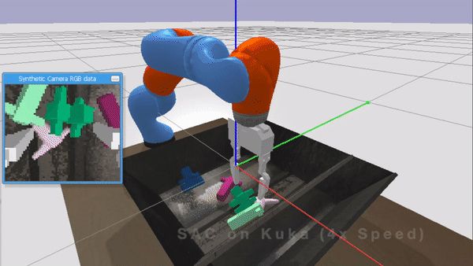
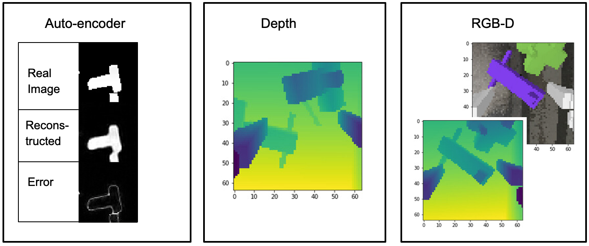

# Soft Actor Critic PyBullet Kuko
Trains a robotics model using an integrated curriculum learning-based gripper environment. The environment can utilize different perception layers such as depth and RGB-D. The model will be pretrained with SAC, BDQ, and DQN algorithms and tested on a variety of different scenes and domains.

### Prerequisites

Install anaconda. Start a clean conda environment.

```
conda create -n robo_env python=3.6
conda activate robo_env
```
python manipulation_main/training/train_stable_baselines.py train --config config/gripper_grasp.yaml --algo SAC --model_dir trained_models/SAC_full --timestep 100000 -v

## Installation 

Use pip to install the dependencies.

```
pip install -e .
```

## Run Models

```
python manipulation_main/training/train_stable_baselines.py run --model trained_models/SAC_full_depth_1mbuffer/best_model/best_model.zip -v -t
```


## Train models

```
python manipulation_main/training/train_stable_baselines.py train --config config/gripper_grasp.yaml --algo SAC --model_dir trained_models/SAC_full --timestep 100000 -v
```

## Screenshots






### References

* https://arxiv.org/abs/1801.01290
* https://pybullet.org/wordpress/index.php/forum-2/
* https://github.com/rainorangelemon/PyBullet-Kuka
* https://github.com/erwincoumans/pybullet_robots
* https://github.com/BarisYazici/tum_masters_thesis
